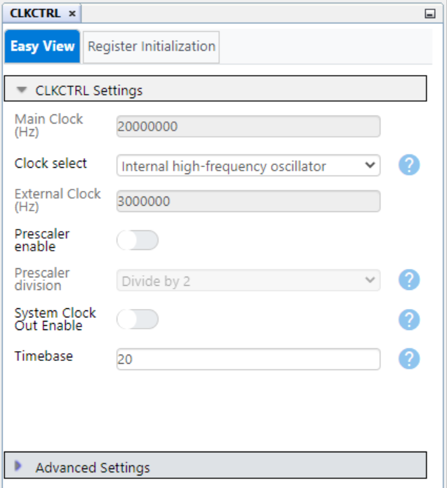
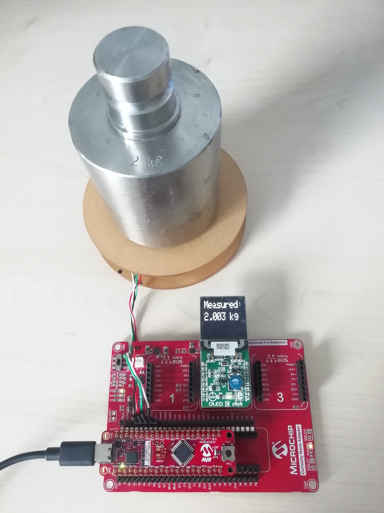

 
 
# Analog-to-Digital Converter (ADC) – Timed Load Cell Signal Measurement with ADC and TCF Using the AVR16EB32 Microcontroller with MCC Melody

This project showcases the advantages of the Analog-to-Digital Converter (ADC) with Programmable Gain Amplifier (PGA) and Burst Accumulation mode. A weight scale application is developed, using the ADC peripheral to measure the output signal of a strain gauge load cell. As the signal provided by the load cell is in the range of a few millivolts, the application provides the perfect opportunity to feature the hardware enhancements of the ADC peripheral.

A load cell is an electromechanical sensor used to measure force or weight. Through a mechanical
arrangement, the force being sensed deforms a strain gauge. The strain gauge measures the deformation as a change in electrical resistance. A load cell usually consists of four strain gauges in a Wheatstone bridge configuration.

 

The application uses the Event System (EVSYS) and the Timer/Counter type F (TCF) peripheral to periodically trigger ADC conversions. The ADC peripheral is operating in Burst Accumulation mode and generates an interrupt every 1024 accumulated samples. The internal PGA is enabled and the gain is set to 16. The input signal is first fed to the PGA for amplification before reaching the conversion stage. For improved accuracy, additional software accumulation is performed. The resulting values are converted to weight and displayed on a Mikroe® OLED Click board, and in the Data Visualizer (DV) interface using the SPI and the USART peripherals, respectively.

 

## Related Documentation

- [AVR16EB32 Data Sheet](https://ww1.microchip.com/downloads/aemDocuments/documents/MCU08/ProductDocuments/DataSheets/AVR16EB14_20_28_32-Prelim-DataSheet-DS40002522.pdf)
- [AVR16EB32 Product Page](https://www.microchip.com/en-us/product/AVR16EB32)

## Software Used

- [MPLAB® X IDE](http://www.microchip.com/mplab/mplab-x-ide) v6.15 or newer
- [MPLAB® XC8](http://www.microchip.com/mplab/compilers) v2.45 or newer
- [AVR-Ex_DFP](https://packs.download.microchip.com/) v2.8.189 or newer

## Hardware Used

- [AVR16EB32 Curiosity Nano](https://www.microchip.com/en-us/development-tool/EV73J36A) development board:
 

- [Curiosity Nano Base for Click Boards™](https://www.microchip.com/en-us/development-tool/AC164162):
   

- Micro Load Cell (0~5kg)
   

- [OLED C CLICK Board](https://www.mikroe.com/oled-c-click) (mikroBUS socket 2):
   

## Operation

To program the Curiosity Nano boards with this MPLAB® X project, follow the steps provided in the [How to Program the Curiosity Nano Board](#how-to-program-the-curiosity-nano-board) chapter.  

## Setup

The following configurations must be made for this project:

- Configuration bits:
  - High-frequency Oscillator: 20 MHz
  - Watchdog Timeout Period: Watchdog Timer (WDT) off

   

- Clock Control:
  - Clock select: Internal high-frequency oscillator
  - Prescaler enable: No

   

- Interrupt Manager:
  - Global Interrupt Enable: Yes

   
   

- TCF0:
  - Timer Enable: Yes
  - Clock Source Select: CLKPER
  - Clock Prescaler: DIV1
  - Waveform Generation Mode: FRQ
  - Requested Period: 0.02s

   
   

- ADC0:
  - Prescaler Value: System clock divided by 10
  - Sample Duration: 12
  - ADC Enable: Yes
  - Mode: Burst
  - Differential Mode: Yes
  - Sample Numbers: 1024 samples accumulated
  - Start Command: Start when an event is received
  - Free-Running Mode: No
  - Reference Select: Internal 1.024V Reference
  - Analog Positive Channel Selection: ADC input pin 5
  - Analog Negative Channel Selection: ADC input pin 4
  - Analog Inputs Via: Inputs connected via PGA
  - Sign Chopping: Enabled
  - Result Ready Interrupt Enable: Yes
  - PGA Enable: Yes
  - PGA BIAS Select: 100% BIAS current
  - Gain: 16x gain

   
   

- USART0:
  - Enable USART Receiver: Yes
  - Enable USART Transmitter: Yes
  - Requested Baudrate: 115200
  - Parity: None
  - Data Size: 8
  - Stop Bits: 1
  - Redirect Printf to UART: Yes
  - Interrupt Driven: No

   
   

- SPI0
  - Interrupt Driven: No
  - Enable SPI: Yes
  - Modes: Host
  - SPI Mode: 0
  - Desired Clock Speed (Hz): 2500000

   

- Event System:
  - Generator: TCF0_OVF
  - Channel: CHANNEL0
  - User: ADC0START

   
   

| Pin | Configuration  |          Description         | Custom name |
| :-: | :------------: | :--------------------------: |-------------|
| PD5 |  Analog input  |  ADC positive input channel  |             |
| PD4 |  Analog input  |  ADC negative input channel  |             |
| PC1 | Digital output |          USART0 TXD          |             |
| PC2 | Digital input  |          USART0 RXD          |             |
| PA4 | Digital output |           SPI MOSI           |             |
| PA5 | Digital input  |           SPI MISO           |             |
| PA6 | Digital output |           SPI SCK            |  oledC_SCK  |
| PC0 | Digital output |      OLED board RST pin      |  oledC_RST  |
| PC3 | Digital output |      OLED board EN pin       |  oledC_EN   |
| PD2 | Digital output |      OLED board DC pin       |  oledC_DC   |
| PD7 | Digital output |      OLED board RW pin       |  oledC_RW   |
| PF3 | Digital output |      OLED board CS pin       |  oledC_nCS  |
| PF6 | Digital input  |      Button input pin        |   BUTTON    |

   
   

## Demo

Hardware setup and DV serial terminal windows:
  - 1 kg object on the scale:
 
 

  - 2 kg object on the scale:
 
 

To observe the results plotted on a graph, follow the steps provided in the [How to Use the Data Visualizer](#how-to-use-the-data-visualizer) chapter.

Results plotted in the DV interface: 
  - Without software accumulation implemented:
 

  - With software accumulation implemented:
  

## Summary

This code example showcases the hardware enhancements of the ADC peripheral by implementing a weight scale application. The internal PGA is used to amplify the input signal before conversion and the Burst Accumulation mode is used to improve the accuracy of the measurement. The TCF and the Event System are used to periodically trigger ADC conversions, without software intervention.

##  How to Program the Curiosity Nano board

This chapter shows how to use the MPLAB X IDE to program an AVR® device with an `Example_Project.X`. This can be applied for any other projects. 

1. Connect the board to the PC.

2. Open the `Example_Project.X` project in MPLAB X IDE.

3. Set the `Example_Project.X` project as main project:
   Right click the project in the **Projects** tab and click Set as Main Project.
   

4. Clean and build the `Example_Project.X` project:
   Right click the `Example_Project.X` project and select Clean and Build.
   

5. Select AVRxxxxx Curiosity Nano in the Connected Hardware Tool section of the project settings:
   Right click the project and click Properties.
   Click the arrow under the Connected Hardware Tool.
   Select the AVRxxxxx Curiosity Nano by clicking on the SN.
   Click **Apply** and then **OK**.
   

6. Program the project to the board:
   Right click the project and then Make and Program Device.
   

 

## How to Use the Data Visualizer

1. Open the Data Visualizer:
 

2. In the Curiosity Nano COMn tab, click the **Source options** button and set the Baud Rate:
 

3. From the same tab, select **New variable streamer**:
 

4. Configure the Variable Streamer Name and add the desired variable, then click **Next**:
 

5. Select all the variables to plot, select New axis per data type, and click **Finish**:
 

 

- [Back to Top](#analog-to-digital-converter-adc-–-load-cell-signal-measurement-with-adc-and-tcf-using-the-avr16eb32-microcontroller-with-mcc-melody)
- [Back to Setup](#setup)
- [Back to Demo](#demo)
- [Back to Summary](#summary)
